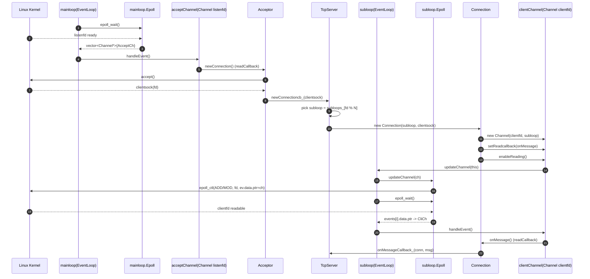

# imitate-muduo

> 仿写陈硕大佬的 muduo 网络库（学习/复习用）。

---

## 复习导航：以 27 目录为例（从 accept 到 onMessage 的两条主线）

你在复习时觉得“封装后逻辑分散、回调跳来跳去很乱”，最有效的解法是把整个链路压缩成两条线：

- **注册线（epoll_ctl）**：把 `fd + events + Channel*` 注册进某个 `EventLoop` 持有的 epoll 实例。
- **触发线（epoll_wait）**：等待内核返回就绪事件，通过 `events[i].data.ptr` 找回 `Channel*`，再分发到 `Connection::onMessage()` 等回调。

### Flowchart：注册线 + 触发线（对应 27 目录代码结构）

```mermaid
flowchart TD
  A[mainloop run] --> B[Epoll loop -> epoll_wait]
  B -->|listenfd ready| C[Channel listenfd handleEvent]
  C --> D[Acceptor newConnection]
  D --> E[accept -> Socket clientsock]
  E --> F[TcpServer newConnection]

  F --> G[select subloop: subloops[fd % nums_threads]]
  G --> H[new Connection(subloop, clientsock)]
  H --> I[new Channel(clientfd, subloop)]
  I --> J[setReadCallback -> Connection onMessage]
  J --> K[enableReading]

  K --> L[Channel enableReading -> subloop updateChannel]
  L --> M[EventLoop updateChannel -> Epoll updateChannel]
  M --> N[epoll_ctl ADD or MOD: ev.data.ptr = Channel*]

  subgraph IO thread subloop
    O[subloop run] --> P[Epoll loop -> epoll_wait]
    P -->|clientfd ready| Q[events data.ptr -> Channel*]
    Q --> R[Channel setrevents]
    R --> S[EventLoop iterate active Channels]
    S --> T[Channel handleEvent]
    T --> U[Connection onMessage]
    U --> V[TcpServer onMessage(conn, msg)]
  end
```

### Sequence：回调“接力棒”时序图



---

## 快速复习锚点（迷路就回到这 4 个点）

1. **谁在 wait？** `EventLoop::run()`（循环里调用 `Epoll::loop()`）
2. **谁在 ctl？** `Epoll::updateChannel()`（`ev.data.ptr = Channel*` + `epoll_ctl(ADD/MOD)`）
3. **谁负责分发？** `Channel::handleEvent()`（根据 `revents_` 调不同 callback）
4. **业务最终落点？** `Connection::onMessage()` -> `TcpServer::onMessage(conn, msg)`

---

## 建议的阅读顺序（按“最短路径”复习）

1. `27/Epoll.cpp`：看 `ev.data.ptr = ch`、`epoll_ctl`、`epoll_wait` 如何把事件还原成 `Channel*`
2. `27/EventLoop.cpp`：看 `run()` 如何遍历 active channels 并调用 `handleEvent()`
3. `27/Channel.cpp`：看 `enableReading/enableWritting` 如何触发 `updateChannel()`
4. `27/Connection.cpp`：看连接创建时如何 `enableReading()` 完成注册，以及读写回调如何触发
5. `27/TcpServer.cpp` + `27/Acceptor.cpp`：看 accept 后如何分配到 subloop 并设置上层回调
